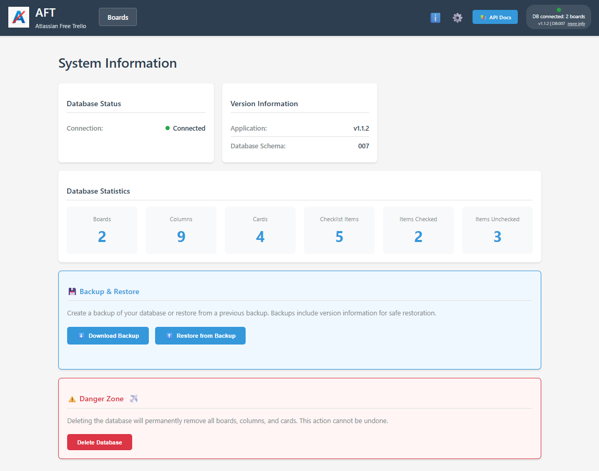

# AFT
Atlassian Free Trello.

## What?
Kanban style task organisation.

## Why?
Trello was great, then Atlassian bought it.

## How?
- Clone the repo to a machine running docker
- Edit .env to have more secure passwords
- `docker compose up -d`
- Navigate to http(s)://{docker-host-ip}

## When?
In one evening for version 1.
That's right this is entirely copilot generated with my general guidance.
I know what it all does, I have no idea what code was written to achieve it.
Use at your own risk.

## Features

### 📋 Board Management
- **Create Multiple Boards** - Organize different projects with separate Kanban boards
- **Update Board Details** - Rename boards and modify their properties
- **Delete Boards** - Remove boards when projects are complete
- **Default Board Setting** - Set a default board to load on startup
- **Board Statistics** - View counts of boards, columns, and cards

### 📊 Column Management
- **Flexible Columns** - Create custom columns for your workflow (e.g., To Do, In Progress, Done)
- **Reorder Columns** - Drag and rearrange columns to match your process
- **Column Operations** - Add, edit, or delete columns as your workflow evolves

### 🎴 Card Management
- **Create Cards** - Add task cards with titles and descriptions
- **Move Cards** - Drag cards between columns to track progress
- **Update Cards** - Edit card details, titles, and descriptions
- **Delete Cards** - Remove completed or cancelled tasks
- **Card Filtering** - View cards by column or across entire boards

### ✅ Checklist Items
- **Task Breakdown** - Add checklist items to cards for subtasks
- **Track Progress** - Check off items as you complete them
- **Update Checklists** - Modify checklist item text and completion status
- **Remove Items** - Delete checklist items when no longer needed

### 💬 Comments
- **Card Discussion** - Add comments to cards for collaboration
- **Comment History** - View all comments on a card with timestamps
- **Delete Comments** - Remove outdated or incorrect comments

### ⚙️ Settings & Configuration
- **Customizable Settings** - Configure application preferences
- **Settings Schema** - View available settings and validation rules
- **Persistent Configuration** - Settings saved to database

### 🔧 Database Management
- **Backup Database** - Download complete database backups
- **Restore Database** - Upload and restore from backup files
- **Reset Database** - Clear all data for fresh start
- **Version Tracking** - Monitor application and database schema versions

### 🔌 API Documentation
- **Interactive API Docs** - Built-in Swagger UI at `/api/docs`
- **RESTful API** - Full API access for integrations and automation
- **Health Checks** - Database connectivity and version endpoints

