# AFT
Atlassian Free Trello.

## What?
Kanban style task organisation.

## Why?
Trello was great, then Atlassian bought it.

## How?
- Clone the repo to a machine running docker
- Edit .env to have more secure passwords
- Configure WebSocket CORS for your deployment (see Configuration section below)
- `docker compose up -d`
- Navigate to http(s)://{docker-host-ip}

### Configuration

#### CORS Origins (HTTP/HTTPS/WebSocket)
The application enforces CORS (Cross-Origin Resource Sharing) on all web traffic: HTTP, HTTPS, and WebSocket connections. By default, CORS is restricted to localhost addresses for development safety. For production deployments or when accessing from different hosts, update the `CORS_ALLOWED_ORIGINS` environment variable in `.env`:

**Development (default):**
```
CORS_ALLOWED_ORIGINS=http://localhost,http://127.0.0.1,https://localhost,https://127.0.0.1
```

**Production (example with multiple trusted domains):**
```
CORS_ALLOWED_ORIGINS=https://yourdomain.com,https://www.yourdomain.com
```

**Custom Host / Docker Host Access:**
```
CORS_ALLOWED_ORIGINS=http://your-docker-host-ip,https://your-docker-host-ip,https://your-hostname
```

Provide a comma-separated list of all origins that should be allowed to connect, including the exact scheme and host you use in the browser (for example https://staustell). This prevents Cross-Site Request Forgery and Cross-Site WebSocket Hijacking attacks by only accepting connections from trusted sources.

#### HTTPS and Session Cookie Security
By default, the stack now enforces secure session cookies and redirects direct HTTP requests to HTTPS.

- Nginx auto-generates a self-signed certificate at startup when no certificate files exist, so HTTPS works out of the box without manual certificate setup.
- Flask defaults `SESSION_COOKIE_SECURE=true`, so browsers only send session cookies over HTTPS.
- The HTTP listener (port 80) redirects non-localhost traffic to HTTPS unless an upstream reverse proxy forwards `X-Forwarded-Proto: https`.

This keeps direct deployments secure by default while still supporting external reverse proxies and certificate resolvers.

### Backup Storage
Automatic backups are stored on the host filesystem at `./backups/` (relative to the docker-compose.yml location). This directory is automatically created by Docker and persists across container restarts. You can include this directory in your host backup solution for additional data protection.

**Permission Requirements**: The container runs as a non-root user (UID 1000). If the `./backups/` directory is not writable, backups will fail with a permission error displayed in the UI. To fix this, run:
```bash
sudo chown -R 1000:1000 ./backups
sudo chmod -R 755 ./backups
```

## Testing

For developers who want to run the test suite:

```powershell
cd server
python -m venv venv
.\venv\Scripts\Activate.ps1
pip install -r requirements-dev.txt
pytest
```

**Note:** Tests automatically handle authentication by creating a test admin user. For detailed testing instructions including fresh database setup, see [server/TESTING.md](server/TESTING.md).

## Contributing and Agent Context

If you are contributing code (human or AI-assisted), start with [CONTRIBUTING.md](CONTRIBUTING.md).

For portable, agent-specific project context that should be available across machines via git, use [AGENT_CONTEXT.md](AGENT_CONTEXT.md). Keep this file concise and focused on stable workflow/security/testing facts.


## Security and Access Control

The application now includes a multi-user security model with authentication, role-based authorization, and secure-by-default deployment settings.

- **Authentication Across HTTP + WebSocket** - Login/logout is enforced for protected API access and real-time socket connections.
- **Role-Based Access Control (RBAC)** - Supports global and board-specific roles with permission checks on backend endpoints.
- **Permission-Aware UI** - Frontend controls are shown/hidden based on effective permissions, reducing invalid actions before API calls.
- **Ownership and IDOR Protection** - Server-side scoping checks prevent users from accessing resources they do not own or are not assigned to.
- **Secure Session Defaults** - HTTPS-first behavior, secure session cookies by default, and optional Redis-backed server-side sessions.
- **Operational Hardening** - Token-protected health checks and browser hardening headers in the reverse proxy layer.

### Access Model and User Lifecycle

- **Board Ownership and Sharing** - Boards are owned by a user, and access can be shared per board. Board-specific roles enable read-only access (viewer) or read/write collaboration (editor) without granting global access to all boards.
- **Fine-Grained Per-Board Permissions** - Effective permissions are evaluated per board, so actions like editing or deleting are allowed only where the user has board-level rights.
- **Custom Role Construction** - Role management supports building custom roles from individual permission blocks, then assigning those roles to users within the allowed assignment scope.
- **Controlled Role Assignment** - Role changes require role-management permissions, with backend checks to prevent unauthorized escalation and invalid global vs board-specific assignments.
- **Registration and Approval Workflow** - New user registrations are created in a pending state and must be approved by an administrator before login access is granted.
- **First Admin Initial Setup** - A dedicated setup flow creates the first administrator account, auto-approves it, and completes initial bootstrap for the instance.
- **User Profile Colours** - Each user is assigned a default avatar/profile colour (RGB hex) on account creation and can update it from the Profile page.

For implementation details and extension guidance:
- [server/AUTHENTICATION.md](server/AUTHENTICATION.md)
- [server/PERMISSION_MODEL.md](server/PERMISSION_MODEL.md)
- [PERMISSION_UI_SYSTEM.md](PERMISSION_UI_SYSTEM.md)
## When?
In one evening for version 1.
That's right this is entirely copilot generated with my general guidance.
I know what it all does, I have no idea what code was written to achieve it.
Use at your own risk.

## Features

### Working Style Configuration
The application supports different working styles to accommodate various team preferences.

- The Working Style option in General Settings sets the default for new boards you create.
- Existing boards keep their own working style and can be changed from each board's settings menu.

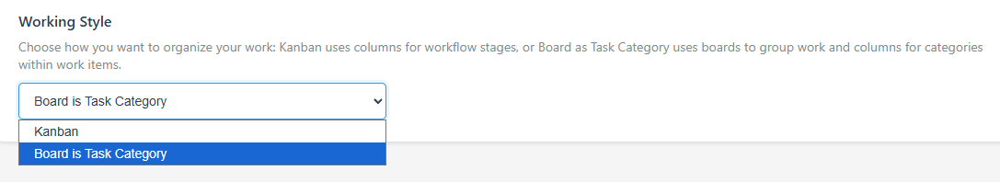

**Available Options:**
- **Kanban** - Traditional column-based workflow where cards move through stages (To Do, In Progress, Done, etc.)
- **Agile** - Enables done tracking and a dedicated Done View on the board

In Agile mode, cards use Done/Not Done status and the Archived View is hidden. In Kanban mode, archive workflows remain available. For detailed information on using these features, see the Docs page (accessible from the user menu in the header).

### 📋 Board Management
- **Create Multiple Boards** - Organize different projects with separate Kanban boards
- **Update Board Details** - Rename boards and modify their properties
- **Delete Boards** - Remove boards when projects are complete
- **Default Board Setting** - Set a default board to load on startup
- **Board Statistics** - View counts of boards, columns, and cards

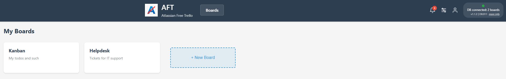

### 📊 Column Management
- **Flexible Columns** - Create custom columns for your workflow (e.g., To Do, In Progress, Done)
- **Reorder Columns** - Rearrange columns to match your process
- **Column Operations** - Add, edit, or delete columns as your workflow evolves
- **Column Menu** - Access column actions via three-dots menu:
  - **Move All Cards** - Batch move all cards from one column to another (top or bottom position)
  - **Archive All Cards** - Archive all active cards in a column at once
  - **Archive After...** - Automatically archive cards older than a specified time period
    - Configure time period (e.g., 7 days, 2 weeks, 3 months)
    - Preview which cards will be archived before committing
    - See the most recent card that will be archived with card details
    - Uses card's last update time to determine eligibility
    - Ideal for automatically cleaning up completed or stale tasks
  - **Unarchive All Cards** - Unarchive all archived cards in a column (visible in archive view)
  - **Delete All Cards** - Remove all cards from a column
  - **Delete Column** - Remove the entire column

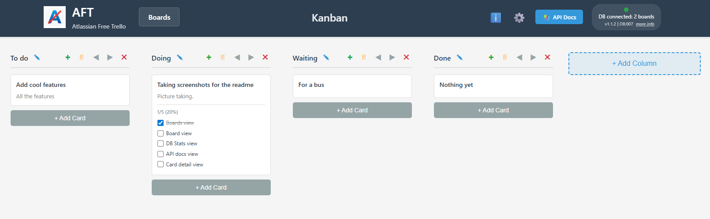

### 🎴 Card Management
- **Create Cards** - Add task cards with titles and descriptions
- **Move Cards** - Drag cards between columns to track progress
- **Update Cards** - Edit card details, titles, and descriptions
- **Assign Responsibility** - Set a primary assignee and optional secondary assignees per card from users with board access
- **Assignee Avatars** - Cards show the primary assignee initials in a bottom-left avatar circle using the assignee's profile colour
- **Board Assignee Filters** - Toggle a compact assignee filter bar from the header settings menu to show cards for selected assignees, include unassigned cards, and optionally match secondary assignees
- **Delete Cards** - Remove completed or cancelled tasks
- **Archive Cards** - Archive completed cards to declutter your board while preserving history
- **Unarchive Cards** - Restore archived cards back to active view when needed
- **View Switching** - Switch between Task, Scheduled, and Archived views using the header dropdown
- **Batch Operations** - Archive or unarchive multiple cards at once via column menu
- **Timestamps** - Track creation and last update times for all cards, columns, boards, and checklist items
  - Cards display "Updated X ago" on the board view
  - Edit modal shows created and updated timestamps for cards
  - Checklist items show created/updated timestamps in tooltips
  - Timestamps update when content changes (title, description, column) but not when reordering
  - Adding/editing comments or checklist items updates the parent card's timestamp

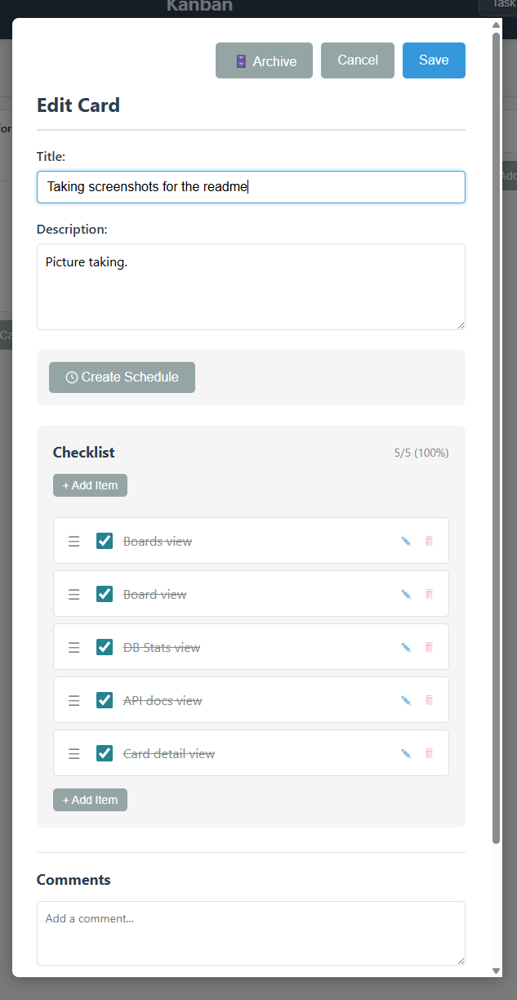
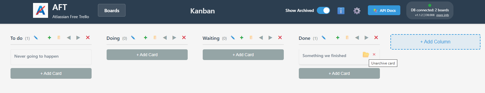

### ✅ Checklist Items
- **Task Breakdown** - Add checklist items to cards for subtasks
- **Track Progress** - Check off items as you complete them
- **Update Checklists** - Modify checklist item text and completion status
- **Remove Items** - Delete checklist items when no longer needed

### 💬 Comments
- **Card Discussion** - Add comments to cards for collaboration
- **Comment History** - View all comments on a card with timestamps
- **Delete Comments** - Remove outdated or incorrect comments

### 🔄 Scheduled Cards (Recurring Tasks)
- **Template Cards** - Convert any card into a recurring task template
- **Flexible Scheduling** - Create cards automatically on a schedule:
  - **Frequency Options**: Every N minutes, hours, days, weeks, months, or years
  - **Start Date/Time**: Configure when the schedule begins
  - **End Date/Time**: Optional schedule expiration (auto-disables when reached)
- **Schedule Management**:
  - **Enable/Disable**: Turn schedules on or off without deleting them
  - **Edit Schedules**: Update frequency, dates, or settings at any time
  - **Delete Schedules**: Remove recurring schedules when no longer needed
- **Duplicate Control** - Prevent duplicate cards in the same column or allow multiple instances
- **Live Preview** - See the next 4 scheduled run times before saving
- **Scheduled View** - Dedicated view for managing template cards (separate from task view)
- **Automatic Creation** - Cards created every minute based on enabled schedules
- **Schedule Tracking** - Auto-generated comments track which schedule created each card
- **Checklist Preservation** - Template checklist items are copied to new cards

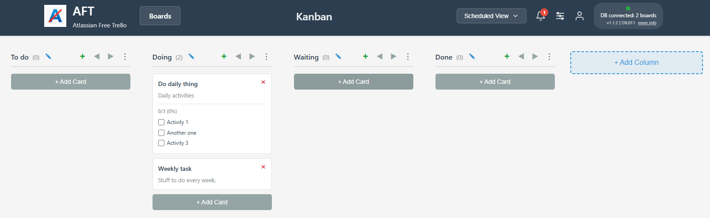
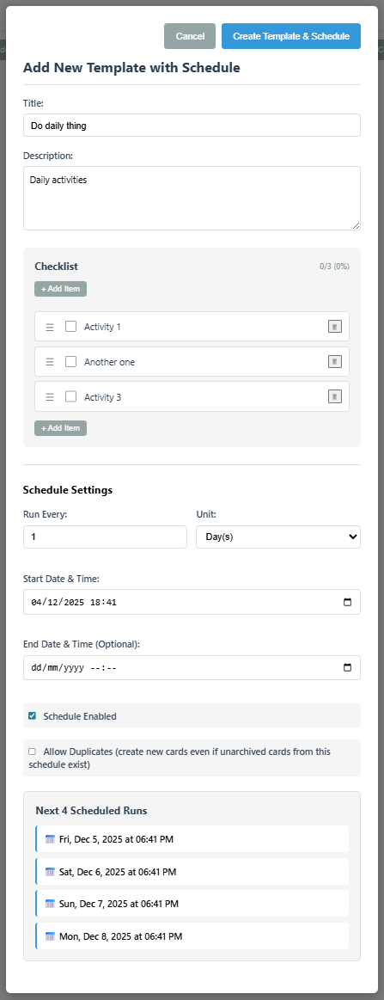

### ⚙️ Settings & Configuration
- **Customizable Settings** - Configure application preferences including default board
- **Time Format Settings** - Choose between 12-hour (AM/PM) or 24-hour time display
- **Working Style Default (New Boards)** - Set your default board style for boards created in the future
  - **Kanban**: Traditional column-based workflow where cards move through stages
  - **Agile**: Board-level done tracking with Done/Not Done workflow
  - **Board-Level Override**: Existing board style is managed from that board's settings menu
  - **Done Button**: Mark cards as complete without moving them between columns in Agile mode
  - **Done View**: Dedicated view to see completed cards in Agile mode
  - **Archived View**: Available in Kanban mode; hidden in Agile mode
  - **Smart Column Counts**: See total and done counts in column headers (e.g., "To Do (2/5)")

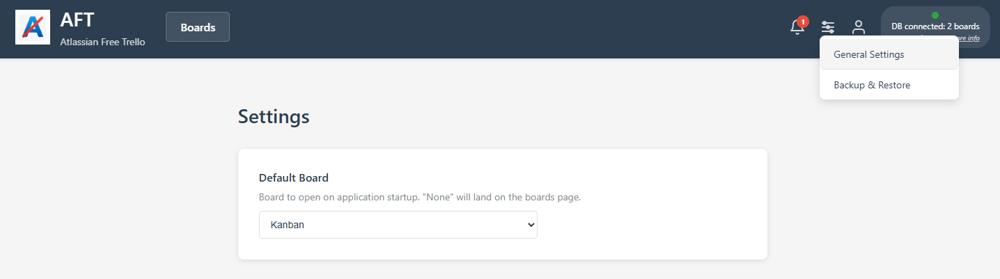

### 🎨 Theme Builder
- **Visual Customization** - Create and customize color themes for the entire application
- **Database-Backed Themes** - Themes stored in database, persist across sessions
- **System Themes** - Pre-built themes (Default, Dark, Light, Solarized) that cannot be modified
- **Custom Themes** - Create unlimited custom themes with your preferred colors
- **Theme Management**:
  - **Create**: Copy existing themes to create your own variants
  - **Edit**: Modify all color variables (primary, secondary, status, text, backgrounds, header)
  - **Rename**: Update theme names for better organization
  - **Import/Export**: Share themes as JSON files
  - **Apply**: Instantly preview and apply themes to your session
- **Background Images** - Select from included background images or upload custom images
  - Pre-loaded with 4 default backgrounds (At the Beach, Sunrise, Welcome to the Jungle, etc.)
  - Upload custom background images for unique theme styling
  - Background images stored in Docker named volume (persistent across restarts)
- **Background Images** - Select from available background images or upload custom images
- **Live Preview** - See color changes in real-time as you edit
- **Organized Theme List** - Themes grouped by User Themes and System Themes, alphabetically sorted
- **Read-Only System Themes** - System themes protected from modification
- **Unsaved Changes Protection** - Warning modal when applying themes with unsaved changes
- **Comprehensive Color Control** - Configure 15+ color variables:
  - Primary and secondary colors with hover states
  - Status colors (success, error, warning)
  - Text colors (primary, muted, inverted)
  - Background colors (light, dark, card backgrounds)
  - Header colors (background, text, menu, buttons, icons)
- **Accessibility** - Full ARIA support, keyboard navigation, screen reader compatible

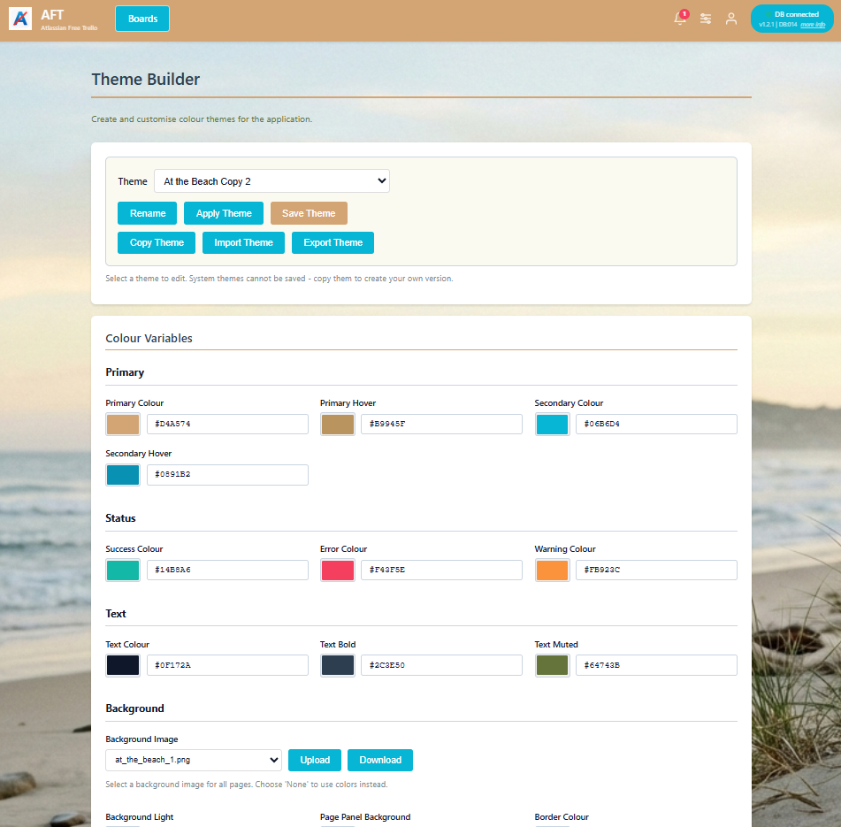

### Automatic Database Backups - Schedule recurring backups to protect your data ###
- Configurable frequency (minutes, hours, or days)
- Flexible start time alignment for backup scheduling
- Automatic retention management (keep 1-100 most recent backups)
- Backup health monitoring with status indicators
- Overdue backup detection
- Backups saved to host filesystem via bind mount (`./backups/`)

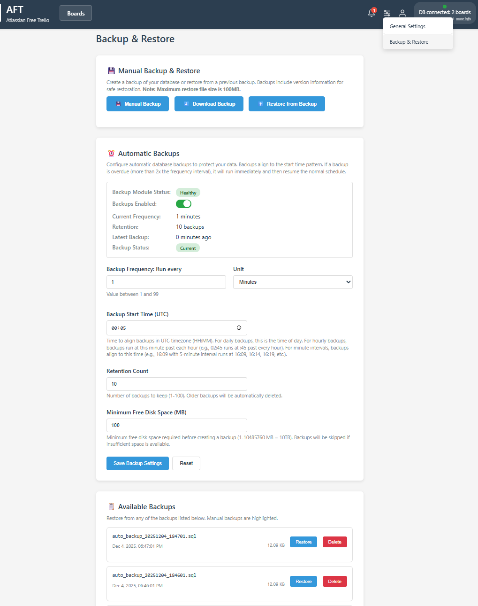

### � Documentation
- **Comprehensive Docs** - Full documentation available in-app via the Docs page
- **Keyboard Shortcuts** - Quick reference for card creation shortcuts (N for top, M for bottom)
- **Working Style Guide** - Detailed guide on using different working styles:
  - Available working style options and when to use each
  - Done/Not Done button functionality and task completion tracking
  - Done View feature for reviewing completed work
  - Column count display and what each number means
  - Screenshots and visual examples of each feature
- **Easy Access** - Link to Docs from the user menu in the header

### 🔔 Notifications
- **System Notifications** - Receive alerts about important events
- **Backup Notifications** - Alerts for overdue backups or backup failures
- **Schedule Notifications** - Alerts for schedule errors or when schedules end
- **Version Notifications** - Automatic alerts when new AFT releases are available
- **Documentation Notification** - Welcome notification on first installation directing users to Docs
- **Action Buttons** - Optional action buttons on notifications with secure URL validation
- **Notification Center** - View and manage all notifications from the header
- **Mark as Read** - Individual or bulk mark notifications as read and delete
- **Notification Badge** - Unread count indicator in header

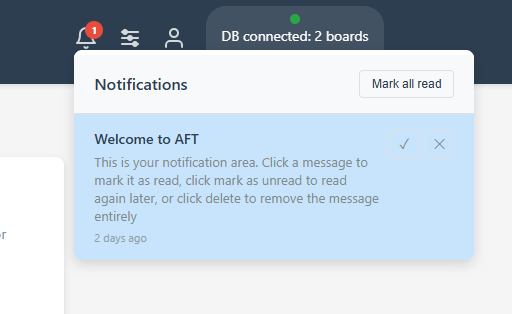

### 🔧 System Info
- **Version Tracking** - Monitor application and database schema versions
- **DB Stats** - Statistics on task entities in the database
- **Service Monitoring** - Status of running system services and enable/disable toggle

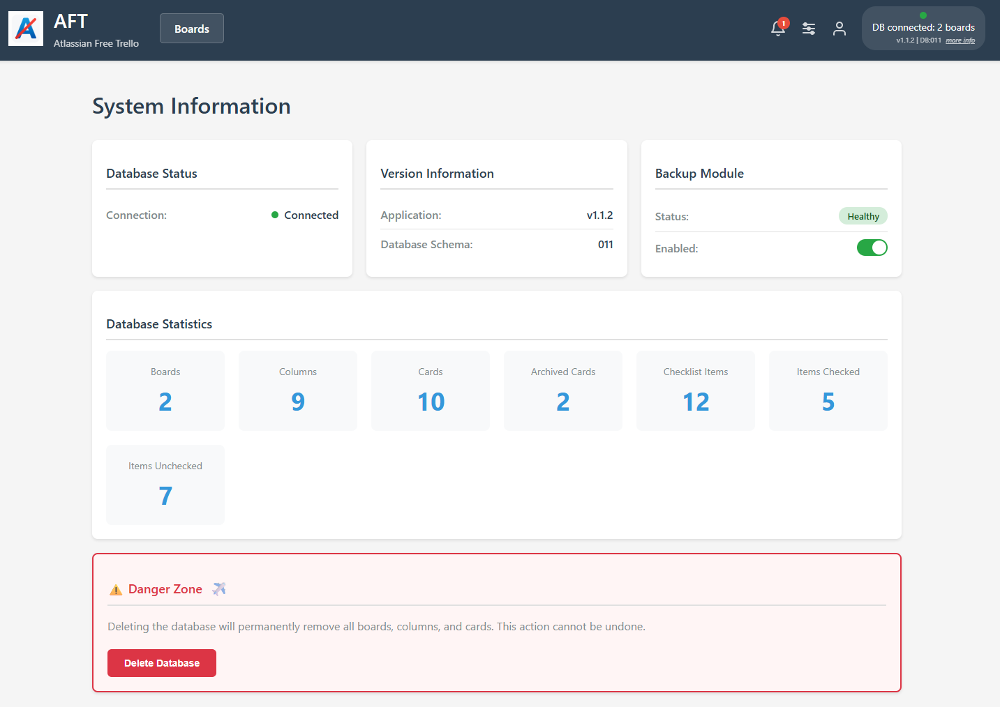

### 🤖 Background Services
- **Backup Scheduler** - Automatic database backup service running every minute
  - Monitors backup schedule and creates backups at configured intervals
  - Enforces retention policies automatically
  - Checks disk space before creating backups
  - Creates notifications for failures or overdue backups
- **Card Scheduler** - Automatic card creation service running every minute
  - Processes enabled schedules and creates cards at scheduled times
  - Enforces duplicate prevention rules
  - Auto-disables schedules past their end date
  - Creates notifications on errors
  - Adds tracking comments to created cards
- **Housekeeping Scheduler** - Automatic maintenance service running every hour
  - Checks GitHub for new AFT releases
  - Creates notifications when updates are available
  - Prevents duplicate notifications for the same version
  - Can be enabled/disabled via System Info page

### 🔌 API Documentation
- **Interactive API Docs** - Built-in Swagger UI at `/api/docs`
- **RESTful API** - Full API access for integrations and automation
- **Health Checks** - Database connectivity and version endpoints

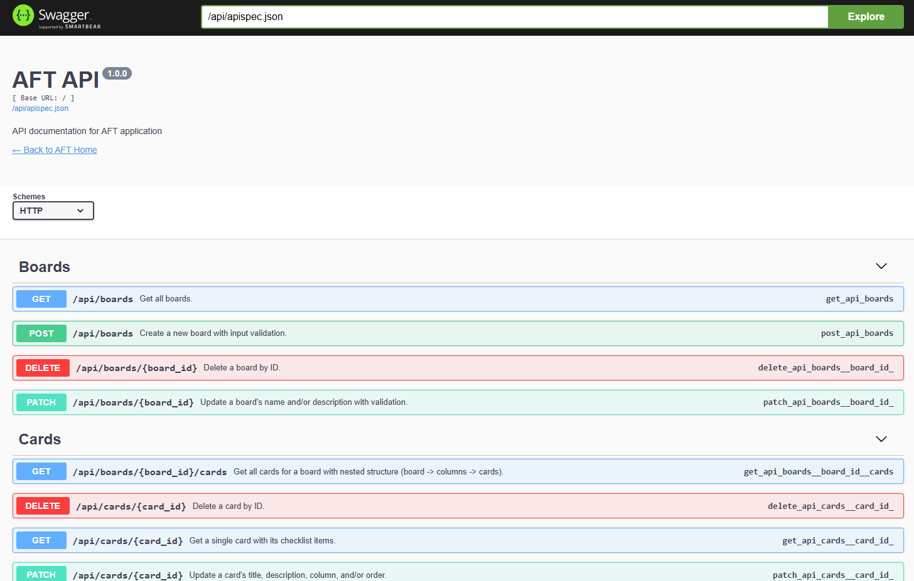

## 📡 System Status Widget

The header displays a real-time system status indicator in the top-right corner. This widget monitors three critical system components and displays their health status:

### Status Indicator Colors & Meanings

| Status | Icon | Color | Meaning | Troubleshooting |
|--------|------|-------|---------|-----------------|
| **Connected** | ✅ | Green | All systems operational | None needed - everything is working normally |
| **Server Disconnected** | ❌ | Red | Cannot reach API server (blocks all operations) | Server is down, check docker containers with `docker compose ps`. Verify network connectivity. Try refreshing the page. |
| **WebSocket Disconnected** | ❌ | Red | Real-time updates unavailable (REST API still works) | Refresh page to reconnect. If persistent, check browser console for errors. Verify CORS settings in `.env`. **Note:** Database operations (create/edit/delete) still work via REST API. |
| **DB Error** | ❌ | Red | Database connection failed (blocks all operations) | Check database container health: `docker compose logs db`. Verify database is running and accessible. Check disk space. |

### Status Checking Order (Priority)

The widget checks system status in this order and stops at the first failure:

1. **Server Connectivity** (Highest Priority)
   - Makes HTTP request to `/api/test`
   - If server doesn't respond or returns error, shows "Server Disconnected"
   - Other checks are skipped when server is down

2. **WebSocket Connection** (Medium Priority)
   - Only checked on board/dashboard pages (where real-time updates are needed)
   - Monitors Socket.IO connection status
   - If loading takes >30 seconds, shows "WebSocket Disconnected"
   - **Important:** WebSocket failures do NOT block database operations
   - REST API calls (create, edit, delete) continue to work normally
   - Only real-time sync features are affected (live updates from other users)

3. **Database Health** (Lower Priority)
   - Queries database directly via API
   - If server is OK but database fails, shows "DB Error"
   - Indicates database-specific issues

### Testing WebSocket Disconnection

To test the WebSocket disconnection scenario (for development/debugging):

1. Edit [server/app.py](server/app.py) line ~237
2. Change `REJECT_SOCKETIO_CONNECTIONS = False` to `REJECT_SOCKETIO_CONNECTIONS = True`
3. Rebuild: `docker compose down ; docker compose up -d --build`
4. Open board page - header shows "WebSocket Disconnected" within 5 seconds
5. Real-time updates will not work
6. Revert the flag to `False` and rebuild to restore connectivity

### Polling & Real-Time Updates

- **Polling Interval**: Status checks happen every 5 seconds
- **Real-Time Events**: Socket.IO events (connect/disconnect) trigger immediate updates
- **Reconnection**: Socket.IO automatically retries failed connections with exponential backoff

## Architecture Decisions

This section documents key architectural choices made in the AFT application.

### Custom Date Math vs. dateutil

**Decision**: Implement custom `_add_months()` and `_add_years()` functions instead of using `python-dateutil`.

**Rationale**:
- Scheduled cards feature only needs simple calendar math (add N months/years)
- `python-dateutil` adds 300KB+ dependency for functionality we don't need
- Our custom implementation handles edge cases correctly:
  - Month overflow (Jan 31 + 1 month = Feb 28/29)
  - Leap years (Feb 29 + 1 year = Feb 28)
  - Year boundaries (Dec 31 + 1 month = Jan 31 next year)
- No timezone/DST complexity needed (app uses local time)
- Custom functions are ~50 lines vs. large library

**When to Reconsider**: If we later need timezone handling, complex recurrence rules (RRULE), or relative deltas with multiple units, consider adding `python-dateutil`.

**Implementation**: See `server/schedule_utils.py` for the custom date math functions.

### Background Services: Daemon Threads vs. Celery

**Decision**: Use simple Python scripts with daemon threads instead of Celery task queue.

**Rationale**:
- Application is single-user/small-scale
- Simple periodic tasks (backups every N minutes, card creation on schedule)
- Don't need distributed task execution, complex workflows, or advanced retry logic
- Simpler deployment (no Redis/RabbitMQ required)
- Easier to debug and maintain
- Threads run within Flask app container, sharing database connections and context

**When to Reconsider**: If application scales to multi-user with complex workflows, many background tasks, or need for task prioritization/distribution, consider Celery.

**Implementation**: See `server/backup_scheduler.py` and `server/card_scheduler.py` for examples of the daemon thread pattern.

### Single Container vs. Microservices

**Decision**: Run all background services as daemon threads within the Flask app container.

**Rationale**:
- Simpler deployment and orchestration
- Shared database connections and SQLAlchemy sessions
- Direct access to Flask app models and utilities
- Lower resource overhead (no inter-service communication)
- Appropriate for single-user application scale

**Trade-offs**:
- All services restart if Flask app restarts
- Can't scale services independently
- Acceptable for current use case

**Implementation**: Background services initialized in `server/app.py` via `init_backup_scheduler()` and `init_card_scheduler()` functions.